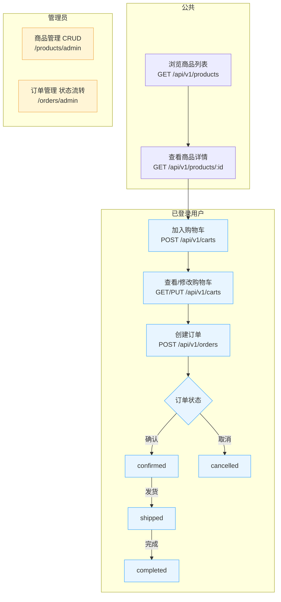

# Mall 模块核心计划（遵循 modules-principle）

## 目标与范围
- 只做核心：商品、购物车、订单；暂不含支付/物流，仅预留字段与状态。
- 目录支持子路径：`src/modules/mall/*`（如 `mall/product`、`mall/order`、`mall/cart`）。

## 模块与目录
- mall/product：商品管理
  - 目录：`src/modules/mall/product/`（model/dto/service/controller/routes）
  - 路由：
    - 公共：`GET /api/v1/products`（分页筛选）、`GET /api/v1/products/:id`
    - 管理：`/api/v1/products/admin`（列表/详情/创建/更新/删除）
- mall/cart：购物车（用户维度）
  - 目录：`src/modules/mall/cart/`
  - 路由（需登录）：`GET/POST/PUT/DELETE /api/v1/carts`、`/api/v1/carts/items/:id`
- mall/order：订单
  - 目录：`src/modules/mall/order/`
  - 路由：
    - 用户：`GET /api/v1/orders`（我的订单）、`GET /api/v1/orders/:id`、`POST /api/v1/orders`（从购物车创建）
    - 管理：`/api/v1/orders/admin`（列表/详情/状态流转：确认/发货/完成/取消）

## 最小数据模型（建议字段）
- Product（products）
  - name, price, stock, status(active|inactive), description?, materials(关联 `materials`，多对多), created_at, updated_at
- CartItem（cart_items）
  - user_id, product_id, quantity, created_at, updated_at
- Order（orders）
  - user_id, total_amount, status(pending|paid|shipped|completed|cancelled), address_json?, remark?, created_at, updated_at
- OrderItem（order_items）
  - order_id, product_id, price, quantity, created_at, updated_at

### 关系补充
- Product ⇄ Material：多对多。
  - 通过中间表 `product_material_relations(product_id, material_id)` 维护关联。
  - 实体层建议在 `Product` 侧使用 `@ManyToMany(() => Material)` + `@JoinTable({ name: 'product_material_relations', joinColumn: { name: 'product_id' }, inverseJoinColumn: { name: 'material_id' } })`。
  - 这样可替代原先的 `images` 字段，支持同一商品关联多种素材（图片、视频、文档等）。

## 规范与中间件
- 管理端路由：`authMiddleware` → `adminMiddleware`，统一挂载在 `/admin` 下。
- 公共端：商品列表/详情可匿名；购物车与订单需登录。
- 列表统一：`paginationQuery()` + `paginationResponse`；筛选使用 `QueryFilterBuilder`。

## 筛选与排序（示例）
- products：`status`、`price_min/price_max`、`keyword(name)`、`sort_by/created_at`、`sort_order`。
- orders（admin）：按 `status/user_id/created_at` 区间。

## 输出与文档
- 每个子模块：提供 `model/dto/service/controller/routes`；在 `src/docs/` 增加 `product.docs.ts`、`cart.docs.ts`、`order.docs.ts`。
- 响应统一 `{ code, message, data }`；异常抛 `HttpException`。

## 集成步骤
1) 从模板复制到：`src/modules/mall//`，替换占位：`__kebabPath__=mall/`、`__kebabName__=`、`__PascalName__=`、`__kebabNamePlural__`。
2) 在 `configs/database.config.ts` 注册实体；在 `src/routes.ts` 注册：`products/orders/carts` 前缀。
3) 开发阶段：直接修改 `number-CreateMallTables.ts` 迁移文件；生产阶段通过迁移管理（`synchronize=false`）。

## 非目标（本期不做）
- 支付对接、发票、优惠券、库存锁定/超卖保护、复杂分类/属性、物流对接。

## 流程总览（Mermaid）

